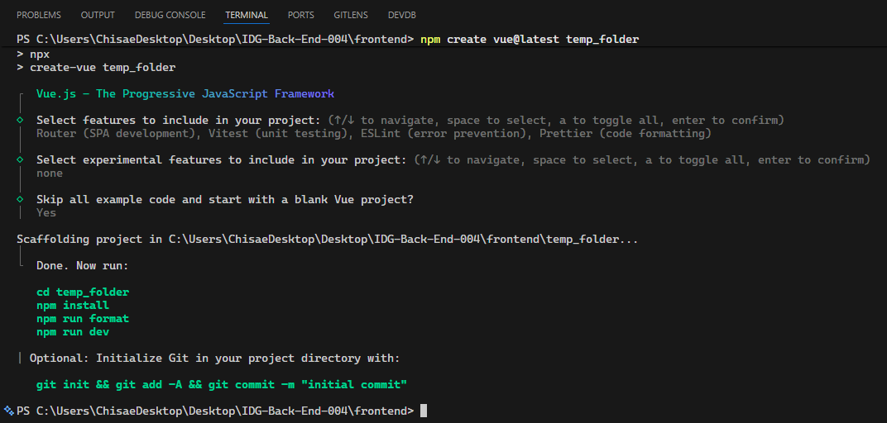

# How to Create a New VueJS Project Inside a Docker Container (Using Docker Compose)

Follow these steps to create a fresh VueJS project inside your Docker container using Docker Compose:

---

## Prerequisites

Before proceeding with the VueJS project creation, ensure you have the following three Docker files in your project directory:

### Required Files:

1. **`Dockerfile`** - Multi-stage Docker configuration for development and production
2. **`docker-compose.yml`** - Docker Compose service configuration 
3. **`.dockerignore`** - File exclusions for Docker builds

### Example File Structure:
```
frontend/
├── Dockerfile
├── docker-compose.yml
├── .dockerignore
└── (Vue project files will be created here)
```

### Sample `Dockerfile`:
```dockerfile
## Development
FROM node:24.12.0-alpine AS development
WORKDIR /app
COPY . .

## Production  
FROM httpd:alpine AS production
WORKDIR /usr/local/apache2/htdocs/
```

### Sample `docker-compose.yml`:
```yaml
services:
  vue-development:
    build:
      context: .
      target: development
    image: my-front-development:latest
    container_name: my-front-development-container
    volumes:
      - ./:/app
    ports:
      - 5173:5173
    tty: true
    stdin_open: true
    environment:
      VITE_HMR_PORT: 5173

  vue-production:
    build:
      context: .
      target: production
    image: my-front-production:latest
    container_name: my-front-production-container
    volumes:
      - ./dist:/usr/local/apache2/htdocs/
    ports:
      - 3000:80
```

### Sample `.dockerignore`:
```
node_modules
npm-debug.log
.git
.gitignore
README.md
LICENSE
.env
dist
```

---

## 1. Make Sure Your Docker Compose Service is Up

First, ensure your Docker Compose service is running. In your project directory (where `docker-compose.yml` is located), run:

```sh
docker-compose up -d
```

This will build and start your container(s) in the background.

---

## 2. Access the Running Container

Next, open a shell inside your running app container. Replace `app` with your service name if different:

```sh
docker compose exec vue-development sh
```

---

## 3. Create a New VueJS Project in a Temporary Folder

Inside the container shell, use Composer to create a new VueJS project in a temporary directory (e.g., `temp_folder`):

```sh
npm create vue@latest temp_folder
```

You will see the Vue.js CLI interface asking you to configure your project:



Follow the prompts to select the features you want:
- **Project features**: Choose Router, ESLint, Prettier, etc. based on your needs
- **TypeScript**: Choose Yes or No depending on your preference  
- **JSX Support**: Usually No unless you need React-like syntax
- **Router**: Yes for SPA routing
- **Pinia**: Yes for state management
- **Testing**: Choose based on your testing needs
- **ESLint**: Yes for code linting
- **Prettier**: Yes for code formatting

---

## 4. Move All Files from `temp_folder` to the Project Root

Still inside the container, move all files and folders from `temp_folder` to the current directory (project root):

```sh
mv temp_folder/* temp_folder/.* . 2>/dev/null || true
```

> **Note:** The `2>/dev/null || true` part suppresses errors for files that can't be moved (like `.` and `..`).

---

## Alternative Method for Moving All Files

Instead of using the `mv temp_folder/* temp_folder/.* . 2>/dev/null || true` command, you can use the following safer method to move all files (including hidden files) from `temp_folder` to the current directory:

```sh
shopt -s dotglob
mv temp_folder/* .
shopt -u dotglob
```

- `shopt -s dotglob` enables the shell option to include hidden files (those starting with a dot) in pathname expansions.
- `mv temp_folder/* .` moves all files and folders, including hidden ones, from `temp_folder` to the current directory.
- `shopt -u dotglob` resets the shell option to its default state.

This approach avoids errors related to moving special directories like `.` and `..`.

---

## 5. Remove the Temporary Folder

Clean up by removing the now-empty `temp_folder`:

```sh
rm -rf temp_folder
```

---

## 6. Install Dependencies and Run the Project

Before exiting the container, install the project dependencies and start the development server:

### Install Dependencies
```sh
npm install
```

---

### 6.1. Update Vite Configuration for Docker

For the Vue.js application to work properly inside a Docker container, you need to update the Vite configuration to allow external connections and enable proper file watching.

### Edit `vite.config.js`

Open the `vite.config.js` file and update it to include the server configuration:

```javascript
import { defineConfig } from 'vite'
import vue from '@vitejs/plugin-vue'

// https://vitejs.dev/config/
export default defineConfig({
  plugins: [vue()],
  server: {
    host: '0.0.0.0',
    port: process.env.VITE_HMR_PORT || 5173,
    hmr: {
      protocol: 'ws',
      port: process.env.VITE_HMR_PORT || 5173,
    },
    watch: {
      usePolling: true,
      useFsEvents: true,
      interval: 1000,
    }
  }
})
```

### Configuration Explanation:

- **`host: '0.0.0.0'`**: Allows the server to accept connections from any IP address (required for Docker)
- **`port: process.env.VITE_HMR_PORT || 5173`**: Uses environment variable or defaults to 5173
- **`hmr`**: Hot Module Replacement configuration for real-time updates
- **`watch.usePolling: true`**: Enables file polling (required for file changes in Docker volumes)
- **`watch.useFsEvents: true`**: Uses file system events when available
- **`watch.interval: 1000`**: Polls for changes every 1 second

### Update Docker Compose (if needed)

Make sure your `docker-compose.yml` includes the environment variable:

```yaml
environment:
  VITE_HMR_PORT: 5173
```

---

---

### 6.2. Start the Development Server

Now start the development server with the updated configuration:

```sh
npm run dev
```

### Build for Production (Optional)
```sh
npm run build
```

The development server will start and you should see output similar to:
```
> vue-project@0.0.0 dev
> vite

  VITE v5.0.0  ready in 200 ms

  ➜  Local:   http://localhost:5173/
  ➜  Network: use --host to expose
  ➜  press h + enter to show help
```

---

Your new VueJS project is now set up in your Docker container and ready for development!

---

## 7. Visit Your VueJS Application


For development server,
Open your browser and go to:

```
http://localhost:5173
```

For production server,
Open your browser and go to:

```
http://localhost:3000
```

You should see the VueJS welcome page if everything is set up correctly.

---
